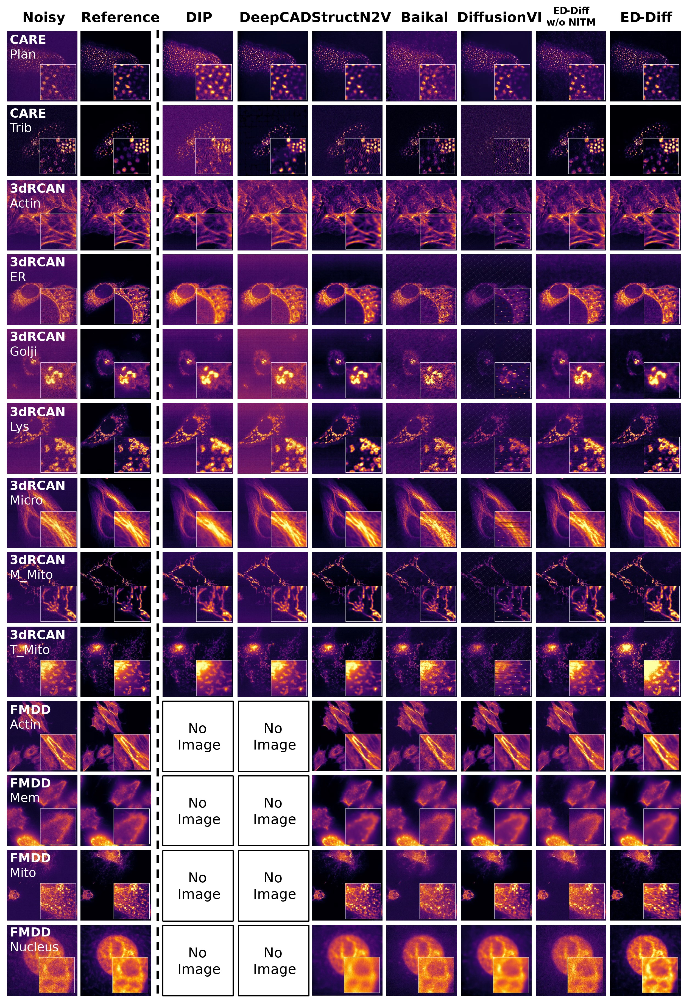

# Usage

Here we provide the hyperparameters used during the pre-training and evaluation of the experiments in the paper, presented in the form of `.sh` scripts. Before usage, it is necessary to download and organize the corresponding data into appropriate folders. The code does not impose strict requirements on the directory structure, but it is recommended to ensure that the target `.tif` files are located within a single folder. Subsequently, copy the relevant script files to the root directory of the repository and modify the parameters within the scripts to reflect your actual file paths. Finally, run the scripts in a compatible environment to conveniently execute the process :

```bash
bash xx.sh
```

The parameters that need to be manually modified in the script are as follows:

* **CUDA_VISIBLE_DEVICES**: GPU index (for pre-training)
* **OPENAI_LOGDIR**: Path to save checkpoints
* **data_dir**: High Signal-to-Noise Ratio Image Folder for Pre-training
* **device**: GPU index (for evaluation)
* **model_path**: Path to the pre-trained model
* **data_dir**: Path to noisy images
* **gt_dir**: Path to reference images of the target images (delete if no reference image is available)
* **save_dir**: Path to save denoised results

# Results


